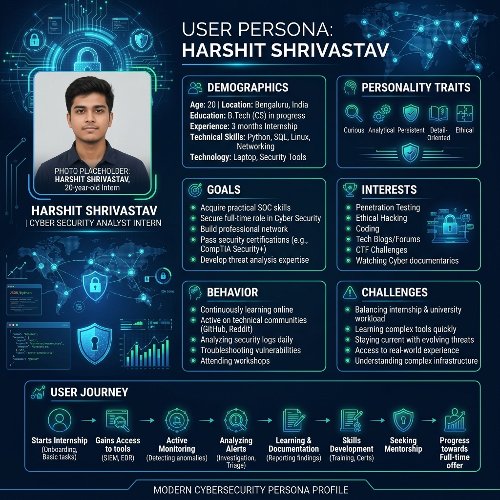

# Techniques of Empathy Building

## User Persona: SpiderVision Intelligence – Social Media Threat Intelligence Platform

**Persona Name:** Anurag Kumar

### Demographic Information
- **Age:** 20
- **Gender:** Male
- **Occupation:** Cyber Security Analyst Intern
- **Education:** B.Tech (Cyber Security)
- **Location:** Noida, Uttar Pradesh
- **Experience:** Beginner to Intermediate

### Goals and Objectives
- Investigate suspicious social media accounts.
- Gather OSINT data efficiently.
- Detect fake profiles and online scams.
- Generate intelligence reports quickly.
- Improve digital investigation skills.

### Psychographic Information
**Interests:**
- Cyber Security
- OSINT
- Digital Forensics
- Threat Intelligence
- Ethical Hacking

**Personality Traits:**
- Analytical
- Curious
- Detail-Oriented
- Problem Solver
- Tech Enthusiast

### Behavior and Preferences
- Uses multiple social media platforms daily.
- Prefers automated intelligence gathering tools.
- Relies on visual dashboards and reports.
- Wants quick and accurate results.
- Uses both mobile and desktop devices.

### User Journey
1. Discovers SpiderVision Intelligence
2. Creates Account
3. Enters Social Media Username
4. Platform Collects OSINT Data
5. Analyzes Threat Indicators
6. Generates Intelligence Report
7. Downloads Report for Investigation

### Challenges and Pain Points
- Manually collecting OSINT data is time-consuming.
- Information is scattered across multiple platforms.
- Difficulty identifying fake accounts.
- Limited tools for beginner investigators.
- Generating reports takes significant effort.

### Quote
> "I need a platform that can quickly gather and analyze social media intelligence so I can focus on the investigation."

---

## User Persona Diagram (Lucidchart)

[Link to Sharable Lucidchart](#) *(Please replace this placeholder with your actual Lucidchart link)*

